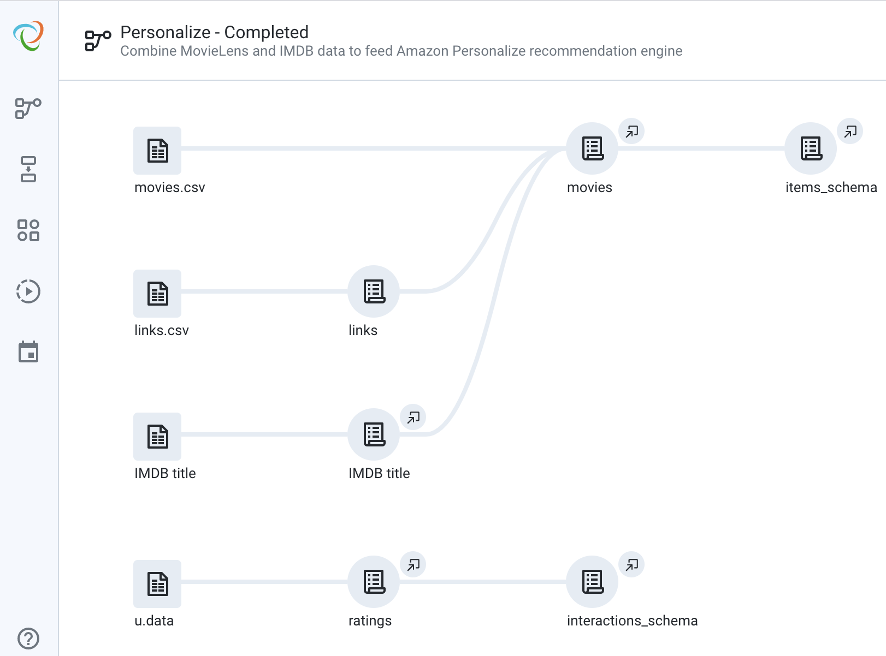

# trifacta-personalize

This is a demo that shows how you can use Trifacta to prepare data for Amazon Personalize. 

It covers the end-to-end flow of starting with raw MovieLens and IMDB data and preparing it for consumption by Amazon Personalize.

This repository contains the completed flow (zip file) that you can import into your own Trifacta installation, as well as the data files that go with it.

